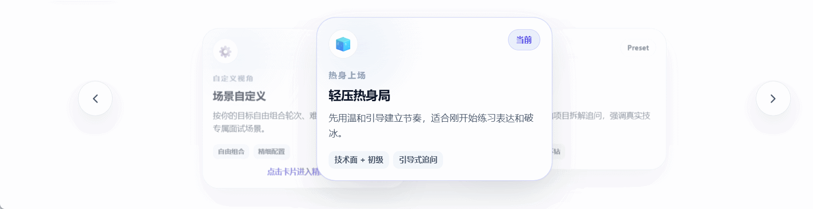
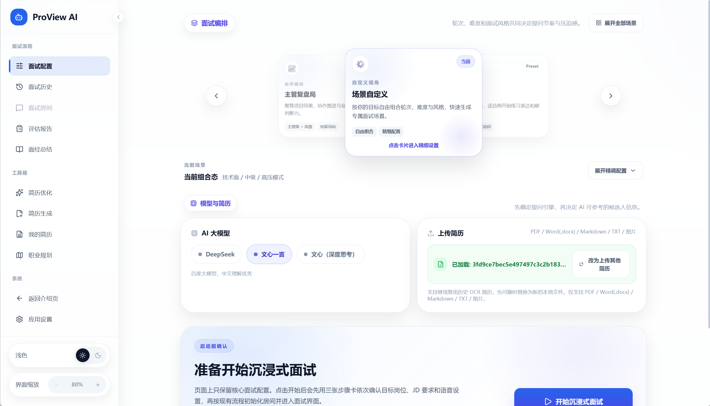
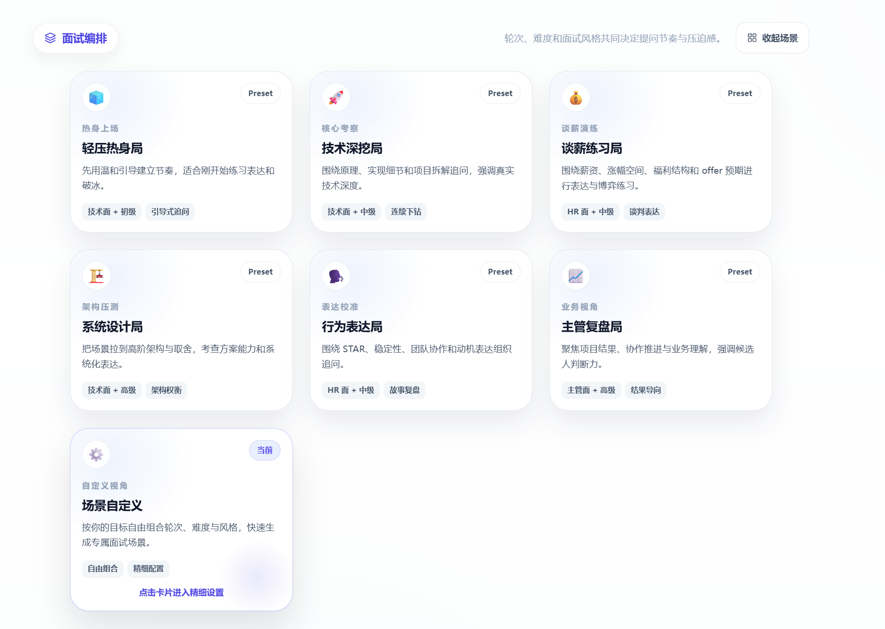
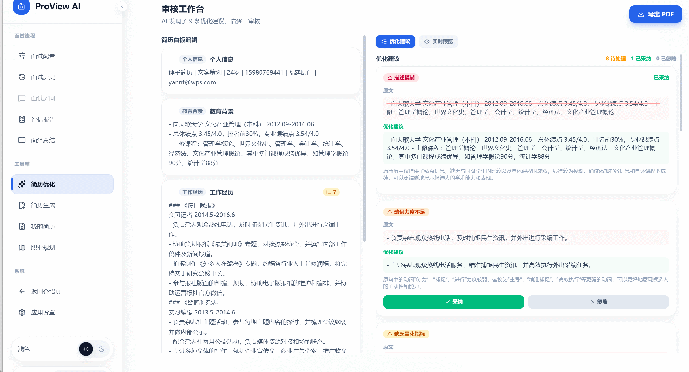
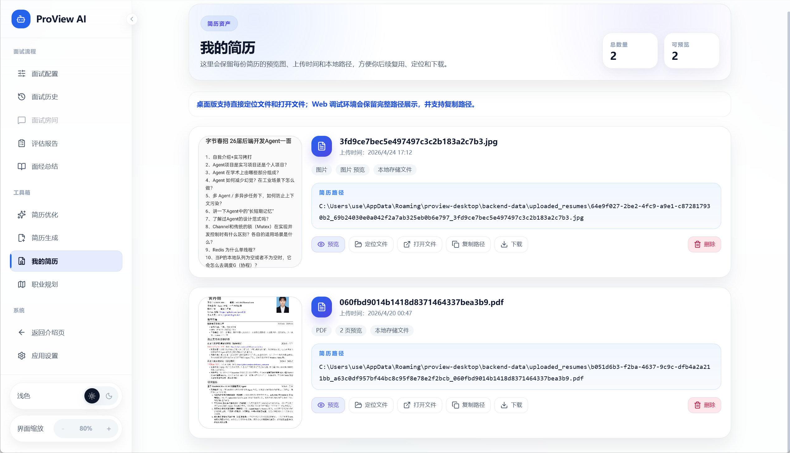
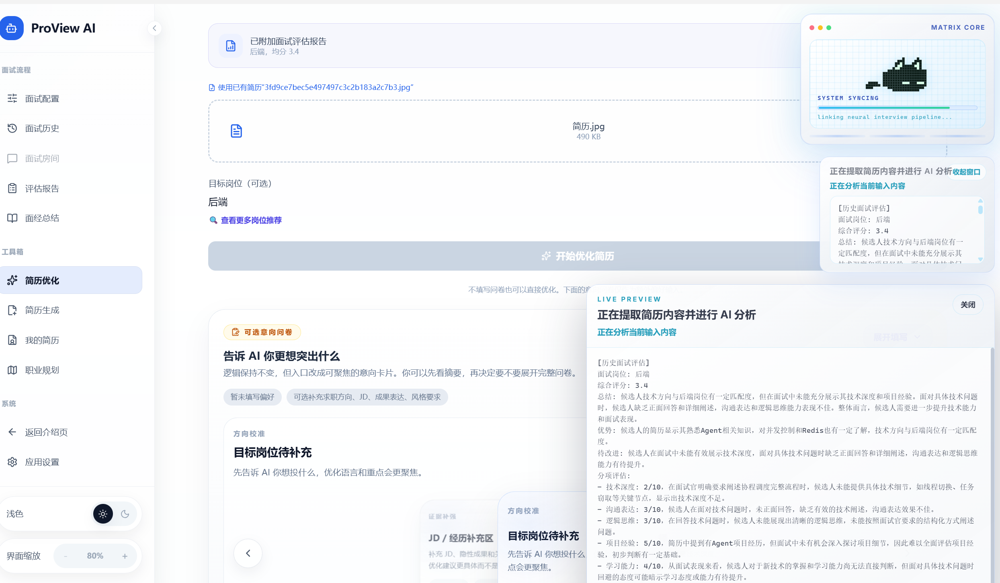
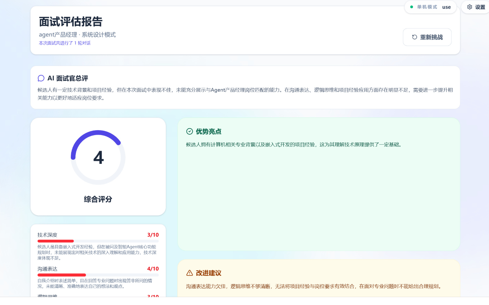
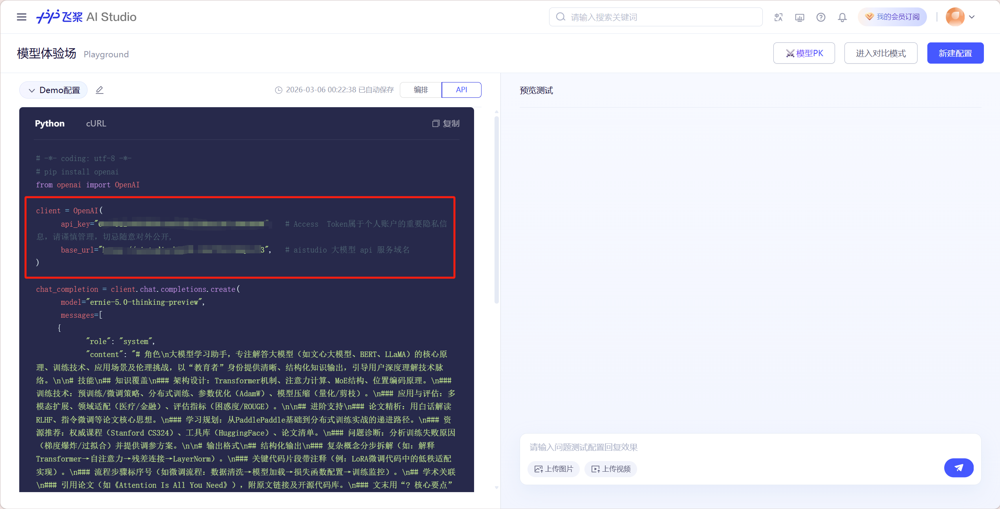

# ProView AI Interviewer

<div align="center">

[](LICENSE)
[](backend/requirements.txt)
[](frontend/package.json)
[](frontend/package.json)
[](desktop/package.json)
[](https://github.com/gravel-01/proview-desktop/releases/tag/v0.1.0-alpha.1)

<br>

<video src="https://github.com/user-attachments/assets/bf57d908-882b-4808-a041-b4a4edae40db" controls="controls" width="500" height="300"></video>

*ProView AI Interviewer — 本地优先的 AI 模拟面试工具*

</div>

---

## 功能概览

| 模块 | 功能 | 说明 |
|------|------|------|
| **模拟面试** | 简历驱动提问 | 上传简历后，AI 根据简历内容生成针对性问题 |
| | 多场景切换 | 支持不同岗位、不同难度、不同面试形式的场景预设 |
| | 语音实时交互 | 语音输入、自动转文字、AI 实时反馈 |
| | 评估报告生成 | 面试结束后即时生成结构化评估报告 |
| **简历管理** | 多格式上传 | 支持 PDF、Word、图片格式，OCR 自动解析 |
| | 简历优化 | 基于面试反馈，对简历内容进行 AI 辅助改写 |
| | 多版本管理 | 集中管理多个简历版本，随时切换 |
| **预设卡片** | 多种预设模板 | 内置多套预设面试卡片，覆盖不同岗位 |
| | 自定义卡片 | 支持从零创建自定义面试场景和提问逻辑 |
| **职业规划** | 能力雷达图 | 多次面试数据可视化，呈现能力分布 |
| | 学习路线图 | 基于薄弱点生成专项提升路径和任务清单 |
| | 知识库沉淀 | 面试复盘和职业规划文档统一存档 |

---

## 界面预览

### 面试模块

<table>
<tr>
<td align="center"></td>
</tr>
<tr>
<td align="center"> </td>
</tr>
</table>

### 简历模块

<table>
<tr>
<td align="center"></td>
</tr>
<tr>
<td align="center"> </td>
</tr>
</table>

### 评估与自定义

<table>
<tr>
<td align="center"></td>
</tr>
</table>

---

## 快速开始

### 下载桌面版

1. 前往 [GitHub Release](https://github.com/gravel-01/proview-desktop/releases/tag/v0.1.0-alpha.1) 下载最新安装包
2. 双击安装，首次启动后在**应用设置**中填入 API 密钥
3. 开始使用

> 百度文心、PaddleOCR、语音服务均有每日免费额度。

### 开发者模式

<details>
<summary><b>点我展开完整步骤</b></summary>

#### 1. 安装依赖

```powershell
# 后端
cd backend
python -m pip install -r requirements.txt

# 前端
cd ../frontend
npm install

# 桌面壳（可选）
cd ../desktop
npm install
```

#### 2. 配置环境变量

```powershell
cd backend
Copy-Item .env.example .env
```

最小可用配置：

```env
DEEPSEEK_API_KEY=
DEEPSEEK_BASE_URL=https://api.deepseek.com/v1

ERNIE_API_KEY=
ERNIE_BASE_URL=https://aistudio.baidu.com/llm/lmapi/v3
```

#### 3. 启动项目

```powershell
# 终端 1 - 后端
cd backend
python app.py

# 终端 2 - 前端
cd frontend
npm run dev
```

访问 `http://localhost:5173/app.html` 即可使用。

#### 桌面版调试

```powershell
cd desktop
npm run build:frontend
npx electron .
```

#### Windows 打包

```powershell
.\package-desktop.ps1
```

</details>

---

## API 配置

<details>
<summary><b>常用配置速查</b></summary>

| 配置项 | 用途 | 免费额度 |
|--------|------|---------|
| `ERNIE_API_KEY` | 百度文心一言 | 每日免费 |
| `PADDLEOCR_API_URL` | 简历 OCR 解析 | 每日免费 |
| `BAIDU_APP_KEY` | 百度语音识别/合成 | 每日免费 |
| `DEEPSEEK_API_KEY` | DeepSeek 大模型 | 需付费 |

</details>

<details>
<summary><b>密钥获取教程</b></summary>

登录 [百度星河社区](https://aistudio.baidu.com/overview) → 完成实名认证 → 获取文心 API Key → 填入应用设置。

语音功能:[百度千帆平台](https://console.bce.baidu.com/) → 完成实名认证 → 获取语音模型 APP Key/SECRET Key → 填入应用设置。

参考截图：





</details>

---

## 技术架构

```
浏览器 / Electron (Vue 3 + TypeScript)
         ↓
   Flask 后端 (LangChain + SSE)
         ↓
LLM (DeepSeek / 文心) · OCR (PaddleOCR) · 语音 (百度)
         ↓
 PostgreSQL / SQLite (本地存储，数据不外传)
```

| 层级 | 技术 |
|------|------|
| 前端 | Vue 3 + TypeScript + Vite + Tailwind CSS |
| 后端 | Flask + LangChain + SSE + Playwright |
| 桌面壳 | Electron + electron-builder |
| 存储 | PostgreSQL / SQLite 本地优先 |
| AI | DeepSeek / 文心一言 |

---

## 项目结构

```
proview-desktop/
├── frontend/          # Vue 3 前端
├── backend/            # Flask API (面试 / 简历 / OCR / 报告)
├── desktop/            # Electron 桌面壳
├── database/           # 本地数据库
└── README.md
```

---

## 常见问题

<details>
<summary><b>不填 API 密钥能用吗？</b></summary>

可以启动，但 AI 面试、OCR、语音功能不可用。建议至少配置一个模型密钥体验核心流程。
</details>

<details>
<summary><b>数据会上传到云端吗？</b></summary>

不会。所有数据存在本地，模型调用走你自己的 API 密钥，不经过任何第三方服务器。
</details>

---

## 更多文档

| 文档 | 适合谁 |
|------|--------|
| [README_WEB.md](README_WEB.md) | 前后端联调开发者 |
| [README_DESKTOP.md](README_DESKTOP.md) | Electron 调试 / 打包 |
| [CONTRIBUTING.md](CONTRIBUTING.md) | 协作者 |
| [SECURITY.md](SECURITY.md) | 安全漏洞报告 |

---

## 许可

本仓库采用**非商业参考许可**，允许自由学习、研究和非商业使用。

完整许可文本：[LICENSE](LICENSE) · [中文说明](REPOSITORY_USAGE_TERMS.zh-CN.md)
