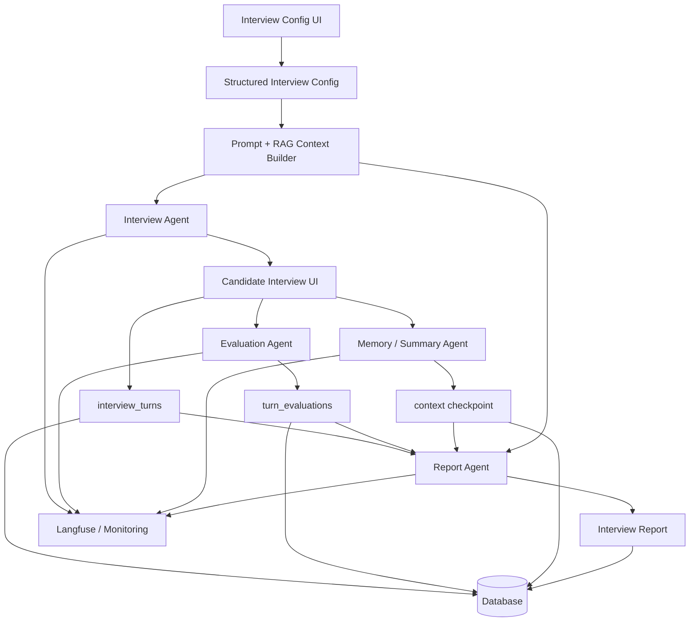
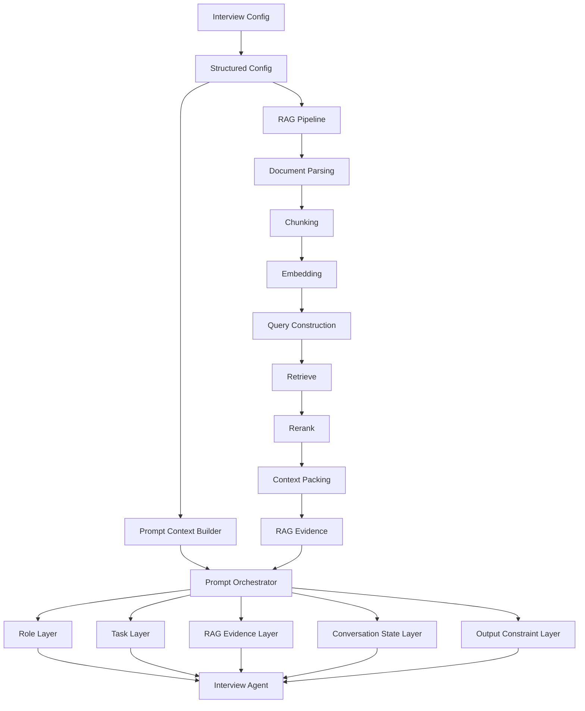
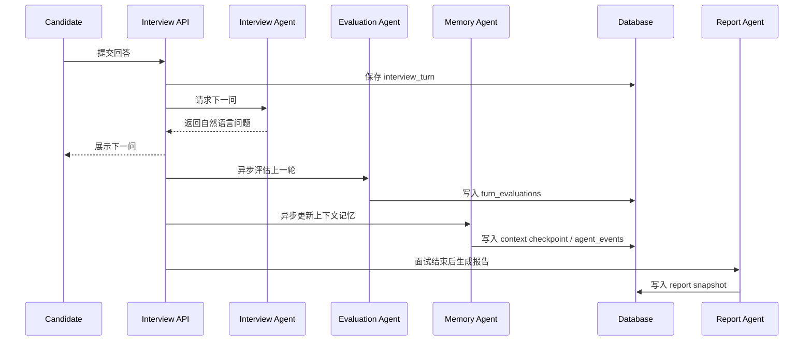

# ProView AI Interviewer 详细设计文档

> 本文档用于说明 ProView AI Interviewer 的系统设计思路。它面向希望了解、维护或复用该项目架构的开发者，重点解释 Prompt、RAG、Multi-Agent、长对话记忆、报告生成、数据持久化和可观测性如何共同组成一个可控的 LLM 面试系统。

---

## 1. 项目定位

ProView AI Interviewer 不是一个简单的 LLM Chatbot，而是一个围绕真实面试流程设计的 LLM 应用系统。

系统将一次 AI 面试拆成两层：

```text
候选人可见层
  自然、连续、低打扰的面试对话

系统内部层
  结构化 turn
  question metadata
  多维评估证据
  长短期记忆 checkpoint
  报告生成依据
  Agent 运行事件
  监控与 fallback 状态
```

这种分层设计的目标是让候选人体验像自然面试，同时让系统内部具备可追溯、可恢复、可评估和可迭代的工程能力。

核心设计原则是：

```text
不是给模型更多上下文，而是给模型当前最有用、最可控、最可恢复的上下文。
```

---

## 2. 设计目标与非目标

### 2.1 设计目标

系统设计围绕以下目标展开：

```text
自然流畅的面试体验
  候选人看到自然语言问题，不被 JSON、评分、系统内部状态打扰。

结构化、可追溯的评估过程
  每一轮面试可以追溯到 turn、问题维度、评分标准和评价证据。

长对话下的 token 成本控制
  不把完整历史和完整文档全部塞进 prompt，而是通过 RAG、短期窗口、长期记忆和状态对齐选择上下文。

可恢复的上下文 checkpoint
  后端重启后仍能从事件表恢复关键上下文，不完全依赖内存。

可兜底的 Multi-Agent 协作
  后台 Agent 可以增强体验，但不能拖垮主对话链路。

可观测、可诊断的 LLM 调用链路
  通过 Langfuse 和 monitoring 观察 prompt、Agent、token、latency、failure 和 fallback。
```

### 2.2 当前非目标

当前阶段不把系统设计成重型分布式架构。

```text
不追求一开始就支持高并发多 worker 部署
不把 Redis 作为权威事实源
不把所有 Agent 都放到同步主链路里
不把完整聊天历史长期塞进 prompt
不把监控设计成查看候选人隐私内容的后台
```

这些不是能力缺失，而是阶段性工程取舍。当前优先级是：主流程稳定、数据可追溯、上下文可恢复、设计复杂度可控。

---

## 3. 总体架构

从用户视角看，一次面试流程是：

```text
配置面试
  -> 开始面试
  -> 与 AI 面试官对话
  -> 结束面试
  -> 查看面试报告
```

从系统视角看，背后是一条由上下文构建、对话生成、后台评估、记忆压缩、报告生成、数据持久化和监控组成的工程链路。



可以把系统拆成七层：

```text
1. 配置层
   面试目标、JD、简历、岗位、难度。

2. 上下文构建层
   Prompt 分层、RAG 检索、context packing、状态注入。

3. 对话生成层
   Interview Agent 负责候选人可见问题。

4. 后台评估层
   Evaluation Agent 异步生成结构化评价。

5. 记忆压缩层
   Memory / Summary Agent 维护短期窗口、长期记忆卡和 checkpoint。

6. 报告生成层
   Report Agent 聚合证据生成最终报告。

7. 可观测层
   Langfuse、Monitoring API、agent_events 观察系统健康。
```

---

## 4. 核心流程设计

### 4.1 创建面试配置

输入：

```text
岗位名称
JD
候选人简历
面试类型
难度
面试目标
```

处理：

```text
JD -> 岗位能力要求 / 技能关键词 / 评价维度
简历 -> 项目经历 / 技术栈 / 候选人事实 / 可追问线索
面试目标 -> 面试阶段 / 难度 / 关注点 / 问题风格
```

输出：

```text
interview_config
resume facts
JD structured summary
RAG indexing input
initial interview state
```

设计原因：

```text
避免每轮都把完整 JD 和完整简历塞进 prompt
让后续 RAG 和 Prompt Builder 可以按阶段选择上下文
让报告和评估有稳定的结构化事实源
```

### 4.2 生成下一轮面试问题

输入：

```text
interview_config
recent turns
InterviewState
RAG top contexts
question metadata history
```

处理：

```text
构造当前阶段 prompt
注入必要 RAG 证据
注入短期对话窗口
注入长期 memory card
约束输出风格和边界
调用 Interview Agent
```

输出：

```text
候选人可见自然语言问题
后台 question_metadata
agent event / trace
```

失败兜底：

```text
Interview Agent 失败 -> 使用模板化问题或确定性追问
question metadata 生成失败 -> RAG rubric / 关键词规则 / 继承上一轮 / 综合表现兜底
RAG 无命中 -> 不阻塞主流程，使用 JD 和简历结构化摘要继续
```

### 4.3 候选人回答后的后台处理

候选人回答后，主流程和后台流程分开。

主流程：

```text
候选人回答
  -> 保存 answer 和 turn_id
  -> Interview Agent 生成下一问
  -> 候选人马上看到下一问
```

后台流程：

```text
上一轮 turn
  -> Evaluation Agent 异步评分
  -> Memory Agent 更新记忆卡
  -> 写入 turn_evaluations / context checkpoint / agent_events
```

设计原因：

```text
候选人体验优先
评分和摘要失败不能阻塞下一问
后台结构化结果可以影响后续追问和最终报告
```

### 4.4 生成最终报告

输入：

```text
interview_turns
question_metadata
turn_evaluations
context checkpoint
RAG evidence
interview_config
```

处理：

```text
按能力维度聚合证据
生成候选人表现总结
识别强项、风险点和改进建议
生成结构化报告
记录报告生成事件
```

输出：

```text
report snapshot
report generation event
fallback status
```

失败兜底：

```text
LLM 调用失败 -> retry
结构化格式错误 -> repair
证据不足 -> 标记信息不足
主报告失败 -> 基于 turn_evaluations 生成模板化 fallback 报告
```

---

## 5. Prompt + RAG Context Builder

### 5.1 为什么不直接拼接完整上下文

最简单的实现方式是把 JD、简历、题库、历史对话全部拼进 prompt，让 LLM 自己理解。但这种方式会带来明显问题：

```text
token 成本高
响应延迟高
上下文噪声多
模型容易忽略中间内容
后续评分口径不稳定
报告依据不可追溯
```

因此系统采用 Prompt + RAG Context Builder，把上下文构建拆成结构化配置、RAG 检索、状态注入和输出约束。



### 5.2 Prompt 分层

Prompt 被拆成多个可维护层：

```text
角色层
  定义 AI 是专业面试官，明确不能编造候选人经历，不能脱离岗位要求提问。

任务层
  定义当前阶段要做什么，例如开场、项目深挖、技术追问、行为面试或总结。

RAG 证据层
  注入当前问题相关的简历片段、JD 要求、题库 rubric 或知识库内容。

对话状态层
  告诉模型已问过什么、已覆盖哪些能力、还有哪些风险点和待追问线索。

输出约束层
  约束候选人可见输出风格，同时避免内部 JSON 或评分信息泄露。

兜底 prompt
  用于异常修复、格式 repair、报告 fallback 或 prompt 重新生成。
```

这种分层让 prompt 可以按场景维护，而不是所有逻辑堆在一个巨大模板里。

### 5.3 RAG 的职责

RAG 在系统里不是独立问答功能，而是上下文选择机制。

它的职责包括：

```text
从完整简历中选择当前最相关的项目片段
从 JD 中选择当前最相关的能力要求
从题库中复用 dimension / rubric
从知识库中召回当前提问需要的背景信息
控制 prompt token，避免全量拼接
```

典型流程：

```text
当前面试阶段
+ 候选人上一轮回答
+ JD 重点
+ 已覆盖能力维度
  |
  v
构造 query
  |
  v
retrieve
  |
  v
rerank
  |
  v
context packing
  |
  v
注入 prompt
```

例子：

```text
简历：负责过 React 后台系统性能优化。
JD：熟悉前端性能优化，有复杂表格或大数据渲染经验。
题库 rubric：性能优化题目应关注瓶颈定位、优化方案、量化指标、权衡成本。
```

系统生成的问题可以是：

```text
你简历里提到做过 React 后台系统性能优化，能讲一下当时的性能瓶颈是什么，你是怎么定位和优化的吗？
```

这比泛泛地问“你做过哪些项目”更有针对性。

### 5.4 Visible Output / Hidden Metadata 分离

Interview Agent 的主职责是维持自然对话，因此系统不强制它每轮输出复杂 JSON。

候选人看到的是自然语言：

```text
你能讲一个你做过的性能优化案例吗？
```

系统内部维护隐藏的 `question_metadata`：

```json
{
  "dimension": "性能优化",
  "rubric": "是否能说明瓶颈、定位过程、优化动作和量化结果",
  "pass_criteria": "至少说明一个明确瓶颈、一个优化动作和一个结果指标",
  "source": "rag_reused_rubric"
}
```

这样做的收益：

```text
主对话更自然
prompt 更短
JSON 泄露风险更低
解析失败不会直接打断面试
Evaluation Agent 可以复用 metadata
最终报告可以追溯评分依据
```

### 5.5 RAG 未命中的兜底

当 RAG 没有命中题库或知识库时，系统不阻塞主流程，而是进入兜底策略。

```text
关键词规则
  问题里出现“性能、优化、延迟、缓存、瓶颈、P95”等关键词时，归到性能优化。

弱追问继承
  如果问题是“可以再展开讲讲吗？”这种弱追问，继承上一轮 question_metadata。

综合表现兜底
  如果仍无法判断，就归到综合表现，保证每轮至少有可用维度。
```

核心原则是：RAG 可以增强系统，但 RAG 未命中不能让系统失去评分口径。

### 5.6 Prompt 灵活性与 DeepSeek 辅助兜底

Prompt 不是只能在工程代码里硬改。系统设计中保留了 prompt 分层、prompt version 和 fallback prompt 的能力。

当某些场景下固定模板效果不足时，例如：

```text
生成问题不够自然
评分维度不稳定
输出结构不符合预期
某类岗位需要更专门的面试指令
```

可以使用 DeepSeek 作为 prompt assistant 或 prompt fallback generator，辅助生成或修复候选 prompt。

推荐链路是：

```text
主 prompt 模板
  |
  | 效果不足、输出异常、场景需要专门指令
  v
DeepSeek 辅助生成 / 修复候选 prompt
  |
  v
系统约束和字段校验
  |
  v
记录 prompt version
  |
  v
进入实际调用链路
```

注意：DeepSeek 不直接接管主流程。它提供的是候选 prompt 或修复建议，仍需要经过约束、校验和版本记录。

边界包括：

```text
不能改变 Agent 职责
不能绕过输出字段约束
不能泄露 hidden metadata
不能把失败 prompt 直接作为主链路
需要通过监控观察 prompt version 的效果
```

---

## 6. Multi-Agent 协作设计

### 6.1 Agent 职责

系统将一次面试拆成多个职责明确的 Agent。

| Agent | 职责 | 是否直接影响候选人可见输出 |
| --- | --- | --- |
| Interview Agent | 自然提问、追问、节奏控制 | 是 |
| Evaluation Agent | 后台评估每一轮回答，生成 `turn_evaluations` | 否 |
| Memory / Summary Agent | 压缩长对话，生成 hidden memory card / checkpoint | 否 |
| Report Agent | 聚合结构化证据，生成最终报告 | 面试结束后影响报告 |

### 6.2 协作流程



### 6.3 防止多 Agent 合作混乱

Multi-Agent 的重点不是让多个模型同时自由发挥，而是让它们在 orchestrator 管理下各司其职。

系统通过以下机制避免协作混乱：

```text
单一候选人可见主链路
  候选人只和 Interview Agent 交互，其他 Agent 不直接输出给候选人。

职责边界清晰
  Interview Agent 不负责最终评分，Evaluation Agent 不决定下一问，Report Agent 不参与实时对话。

结构化输入输出契约
  Agent 通过 turn_id、question_metadata、turn_evaluations、context_checkpoint 和 agent_events 协作。

异步 sidecar 设计
  Evaluation Agent 和 Memory Agent 是后台增强链路，不阻塞下一问。

超时和 fallback
  后台 Agent 超时、解析失败或输出异常时，回退到确定性规则或已有结构化数据。

事件追踪
  每个 Agent 的成功、失败和 fallback 都写入 agent_events，便于监控和定位。
```

### 6.4 Agent 失败兜底矩阵

| 失败位置 | 可能问题 | 兜底策略 | 候选人是否受影响 |
| --- | --- | --- | --- |
| Interview Agent | LLM 超时、生成失败 | 模板问题、确定性追问、重试 | 可能轻微延迟 |
| Evaluation Agent | JSON 解析失败、评分失败 | repair、跳过该轮评分、后续报告使用已有证据 | 不影响实时对话 |
| Memory Agent | summary 超时、输出异常 | 使用确定性 memory card | 不影响实时对话 |
| RAG Pipeline | 无命中、召回噪声 | 使用结构化 JD / 简历摘要和关键词兜底 | 不影响实时对话 |
| Report Agent | 报告生成失败 | retry、repair、模板化 fallback 报告 | 影响报告质量但保证可用 |
| Monitoring | 事件写入失败 | 本地日志或降级记录 | 不影响主流程 |

---

## 7. 长对话与 Token Budget

### 7.1 Token 控制原则

系统不追求把上下文窗口用满。

长面试中，如果把完整聊天历史、完整 JD、完整简历和 RAG 内容全部塞进 prompt，会带来：

```text
成本线性增长
响应越来越慢
模型注意力被大量历史噪声干扰
lost-in-the-middle 风险增加
输出空间不足
重试和格式修复缺少余量
```

因此系统倾向于把输入上下文控制在大约 60% 的可控区间。

这里的 60% 不是固定公式，而是一种 token budget 设计思路：

```text
给模型输出留空间
给 RAG 动态注入留空间
给候选人突然长回答留空间
给 retry / repair 留空间
降低延迟和 token 成本
避免 prompt 变成历史材料堆积
```

### 7.2 三层记忆结构

系统使用三层结构处理长对话。

```text
短期记忆
  最近 5-10 轮原始对话，用于保证当前上下文衔接自然。

长期记忆
  hidden memory card，保存早期候选人事实、风险信号和待追问线索。

状态对齐
  InterviewState，维护当前阶段、已覆盖能力、未验证风险和下一步追问方向。
```

模型每轮看到的上下文不是完整历史，而是：

```text
最近几轮原文
+ 历史摘要
+ 已确认候选人事实
+ 已覆盖能力维度
+ 风险信号
+ 待追问问题
+ 当前 top RAG chunks
```

### 7.3 Hidden Memory Card

当面试变长后，早期关键事实可能不再出现在短期窗口中。系统会生成 hidden memory card。

例子：

```json
{
  "candidate_facts": [
    "候选人做过 React 后台管理系统",
    "候选人负责过权限模块",
    "候选人做过表格性能优化"
  ],
  "risk_signals": [
    "性能优化缺少量化指标"
  ],
  "open_threads": [
    "追问权限模块的角色、资源和权限点设计",
    "追问表格优化前后的具体指标"
  ]
}
```

这样即使第 3 轮原文已经不在短期窗口里，第 25 轮仍然可以自然追问：

```text
前面你提到权限模块，我们还没有展开。你能讲一下当时角色、资源和权限点之间是怎么建模的吗？
```

候选人看不到 hidden memory、JSON、评分或 checkpoint payload。

### 7.4 InterviewState

`InterviewState` 不是聊天记录，而是面试进度表。

```json
{
  "stage": "项目深挖",
  "covered_topics": [
    "项目背景",
    "表格性能优化"
  ],
  "covered_dimensions": [
    "项目经验",
    "性能优化",
    "沟通表达"
  ],
  "candidate_facts": [
    "候选人做过 React 后台管理系统",
    "候选人负责权限模块"
  ],
  "risk_signals": [
    "个人贡献边界还不清楚",
    "性能优化缺少量化结果"
  ],
  "next_followups": [
    "追问权限模块设计",
    "追问性能优化指标"
  ]
}
```

它帮助 Interview Agent 避免重复提问，也帮助系统判断下一步应该补哪些能力维度。

### 7.5 Context Compaction 与 Checkpoint

当上下文接近阈值时，系统会进行 context compaction。

事实源：

```text
interview_turns
question_metadata
turn_evaluations
agent_events
```

输出 checkpoint：

```text
context_version
last_turn_no
estimated_tokens
threshold_tokens
recent_turns
covered_dimensions
candidate_facts
risk_signals
open_threads
open_thread_count
```

checkpoint 只作为 hidden interviewer context，不进入候选人可见消息。

### 7.6 Optional Summary Agent

上下文压缩不是完全依赖 LLM。

系统采用两层设计：

```text
第一层：确定性 memory card
第二层：可选 LLM Summary Agent
```

确定性 memory card 来源于结构化事实源，稳定可控。Summary Agent 只负责把它整理得更语义化、更像面试官笔记。

如果 Summary Agent 超时、输出异常或解析失败，系统直接回退到确定性 memory card。

设计原则：

```text
LLM 可以增强语义质量，但不能绑架主流程
summary 失败不能影响候选人继续面试
hidden metadata 不能泄露给候选人
checkpoint 恢复依赖结构化事实源，而不是内存聊天历史
```

---

## 8. 数据持久化设计

### 8.1 数据实体

核心实体如下：

| 实体 | 职责 |
| --- | --- |
| `users` | 用户信息 |
| `resumes` | 简历解析结果、候选人事实 |
| `interview_configs` | 面试配置，如岗位、JD、难度、目标 |
| `interview_sessions` | 一次实际面试会话 |
| `interview_turns` | 每轮问题和回答 |
| `question_metadata` | 每轮问题的考察维度、rubric、pass criteria |
| `turn_evaluations` | 每轮回答的结构化评分和证据 |
| `reports` | 最终报告快照 |
| `rag_documents` | RAG 原始文档 |
| `rag_chunks` | RAG 切分后的知识片段 |
| `agent_events` | Agent 运行事件、失败事件、fallback、checkpoint |

### 8.2 原始事实与派生结果

系统遵循：

```text
原始事实尽量不重复
派生结果可以适度冗余
```

原始事实：

```text
简历
JD
面试配置
每轮问题与回答
RAG 原始文档
```

派生结果：

```text
简历摘要
JD 结构化结果
question_metadata
turn_evaluations
memory checkpoint
report snapshot
```

派生结果允许适度保存，因为它们和当时的模型版本、prompt version、上下文状态有关。未来模型或 prompt 变化后，历史报告仍需要保留当时的生成结果。

### 8.3 数据复用

可复用数据包括：

```text
同一份 resume 可用于多场面试
同一个 interview_config 可开启多次 session
同一批 rag_chunks 可被多次召回
题库 rubric 可被多个相似问题复用
question_metadata 可被 Evaluation Agent 和 Report Agent 复用
turn_evaluations 可被报告、监控和学习模块复用
```

### 8.4 agent_events 作为事件事实源

`agent_events` 不只是日志，而是系统的事件事实源。

可记录事件：

```text
turn_evaluation_failed
context_compacted
context_summary_failed
assistant_reply_failed
final_report_generation_failed
final_report_generation_succeeded
```

用途：

```text
监控统计
fallback 判断
context checkpoint 恢复
问题定位
多 Agent 链路追踪
```

---

## 9. Redis 取舍与未来演进

### 9.1 当前为什么不使用 Redis

当前系统更偏本地桌面端和单机后端场景。核心诉求是：

```text
面试数据可追溯
报告结果可恢复
context checkpoint 可恢复
部署复杂度可控
```

Redis 适合短期缓存和分布式协调，但不适合作为权威事实源。

例如 context checkpoint 如果只存在 Redis 中，TTL 过期、服务重启或缓存丢失后就可能无法恢复。因此当前选择将 checkpoint 写入 `agent_events.context_compacted`。

当前分层是：

```text
Database
  权威事实源，保存 session、turn、evaluation、report、agent_events。

Process Memory
  进程内加速层，缓存当前 session 的临时上下文。
```

当前不使用 Redis 是阶段性工程取舍，而不是架构能力缺失。

### 9.2 未来如何引入 Redis

当系统演进到云端、多用户、多 worker 部署时，可以引入 Redis，但 Redis 不替代数据库。

未来分层：

```text
SQLite / PostgreSQL：权威事实源
Redis：短期缓存和异步协调层
```

Redis 可承担：

```text
Session Context Cache
  缓存最近几轮对话、InterviewState、最新 checkpoint。

Prompt Context Cache
  缓存 JD 摘要、简历摘要、RAG top chunks，减少重复构造。

Agent Job Queue
  Evaluation Agent、Summary Agent、Report Agent 异步入队。

Distributed Lock
  避免多个 worker 同时给同一个 session 生成下一问或重复写报告。

TTL Privacy Cleanup
  短期上下文设置 TTL，到期自动清理，数据库只保存必要结构化事实。
```

一句话总结：

```text
Redis 负责快，数据库负责准和可恢复。
```

---

## 10. 报告生成设计

### 10.1 报告生成不是聊天总结

最终报告不是让 LLM 简单总结聊天记录，而是结构化证据聚合。

输入：

```text
interview_turns
question_metadata
turn_evaluations
memory checkpoint
RAG evidence
interview_config
```

输出：

```text
能力维度评分
候选人强项
候选人风险点
岗位匹配度
改进建议
证据引用
报告快照
```

报告应尽量能够追溯到具体轮次和证据，而不是泛泛地说“表现不错”。

### 10.2 报告兜底策略

| 问题 | 处理方式 |
| --- | --- |
| LLM 调用失败 | retry |
| 输出格式错误 | repair prompt / parser 修复 |
| 某些维度证据不足 | 标记信息不足，不强行下结论 |
| 主报告生成失败 | 基于 `turn_evaluations` 生成模板化 fallback 报告 |
| 报告生成成功但使用 fallback | 记录 `fallback_used` 供监控分析 |

系统区分两个层面：

```text
用户体验层
  用户最终有没有拿到可用报告。

工程质量层
  主报告链路是否稳定，fallback 是否频繁触发。
```

这使得系统即使在主 LLM 链路不稳定时，也能尽量保证用户拿到可用结果。

---

## 11. Langfuse 与 Monitoring

### 11.1 可观测性目标

LLM 应用上线后，真正困难的不只是“能不能调用模型”，而是系统退化后能不能定位原因。

需要观察的问题包括：

```text
Evaluation Agent 有没有跟上
Summary Agent 是否经常 timeout
context compaction 是否正常触发
report fallback 是否接住失败
哪个 prompt version 更容易解析失败
哪个 Agent token 消耗异常
哪个阶段 latency 变高
```

### 11.2 Langfuse Trace Metadata

每次 LLM 或 Agent 调用建议记录：

```text
trace_id
session_id
agent_name
interview_stage
prompt_version
model_name
token_usage
latency
fallback_used
error_type
```

这些字段可以把一次面试中的配置、RAG、Agent 调用、报告生成串起来。

### 11.3 隐私边界

Monitoring 不应该变成查看候选人内容的后台。

监控应该返回：

```text
counts
rates
timestamps
failure categories
fallback status
latency
token usage
```

不应该返回：

```text
候选人原始回答
评分 evidence 原文
hidden memory
checkpoint payload
报告正文
内部 rubric 细节
```

设计原则：

```text
监控只观察，不干预
只暴露健康信号，不暴露隐私内容
能发现静默失败
能判断 fallback 是否接住主链路故障
```

### 11.4 示例监控指标

```text
evaluation.coverage_rate
evaluation.failure_rate
context_compaction.context_compacted_event_count
context_compaction.context_summary_failure_event_count
context_compaction.latest_context_version
report_generation.success_count
report_generation.failure_count
report_generation.fallback_success_count
agent_events.failure_rollup
token_usage.by_agent
latency.by_agent
```

---

## 12. 可复用设计模式

如果希望在其他 LLM 应用中复用 ProView AI Interviewer 的设计，可以优先复用以下模式。

### 12.1 Prompt + RAG Context Builder

不要把所有上下文全量拼接给模型，而是通过结构化配置、RAG 检索、状态注入和输出约束构造当前最相关的 prompt。

适用场景：

```text
AI 面试
AI 教练
AI 客服
AI 审核
AI 报告生成
```

### 12.2 Visible Output / Hidden Metadata 分离

用户看到自然语言，系统内部维护结构化 metadata。

适用场景：

```text
需要自然交互
又需要后续评分、追踪、报告和监控的 LLM 应用
```

### 12.3 Async Sidecar Agents

一个 Agent 负责用户体验，其他 Agent 作为后台增强链路。

适用原则：

```text
主链路保证体验
后台链路提供增强
增强失败不能拖垮主流程
```

### 12.4 Short Window + Memory Card + State

长对话不要只靠最近几轮，也不要全量历史拼接。

推荐结构：

```text
短期窗口
+ 长期记忆卡
+ 任务状态表
+ 按需 RAG top chunks
```

### 12.5 Database as Source of Truth, Redis as Cache

数据库保存权威事实，Redis 用于加速和协调。

适用原则：

```text
重要事实写数据库
短期状态可进 Redis
Redis 丢失不能导致业务不可恢复
```

### 12.6 Monitoring With Privacy Boundary

监控系统看健康，不看隐私。

推荐暴露：

```text
成功率
失败率
fallback 率
token
latency
trace metadata
```

避免暴露：

```text
用户原文
内部评分证据
隐藏上下文
报告正文
```

---

## 13. 未来演进方向

### 13.1 RAG 评估体系

未来可以建立 RAG 评估集，从以下指标评估召回质量：

```text
precision
recall
faithfulness
context relevance
answer relevance
latency
token cost
```

可以对比：

```text
固定长度 chunk
语义 chunk
按简历模块 chunk
按 JD 模块 chunk
不同 overlap
不同 rerank 模型
```

### 13.2 Prompt Version 实验

对不同 prompt version 进行线上或离线评估：

```text
问题自然度
追问质量
评分稳定性
JSON / schema 解析成功率
token 消耗
fallback 触发率
```

### 13.3 Redis 与异步任务系统

当部署形态升级时，引入：

```text
Redis cache
Agent job queue
distributed lock
worker pool
retry queue
dead letter queue
```

### 13.4 报告质量闭环

基于报告反馈改进：

```text
题库 rubric
Evaluation Agent prompt
Report Agent prompt
RAG chunk strategy
能力维度权重
```

---

## 14. 总结

ProView AI Interviewer 的核心不是“接入一个大模型聊天”，而是把 LLM 放进一个可控的面试系统里。

```text
Prompt 负责约束角色和任务
RAG 负责选择事实上下文并控制 token
question_metadata 连接自然问题和结构化评估
Multi-Agent 负责拆分复杂职责
长短期记忆负责支撑长对话
context checkpoint 保证可恢复
数据库负责沉淀结构化事实和历史快照
fallback 负责保证主流程不崩
Langfuse / Monitoring 负责让系统可观测、可诊断、可迭代
```

这个设计希望提供的不只是一个 AI 面试功能，而是一套可复用的 LLM 应用工程模式：让用户体验保持自然，让系统内部保持结构化、可控、可恢复和可持续优化。
